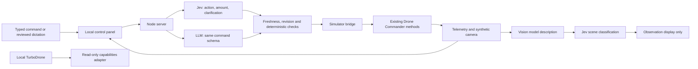

# Flight Lab architecture

The decision is a small enum contract, never generated executable code. Action, step size and clarification are independent Jev questions batched over one state. Their rubrics and thresholds live together in `server/decision-policy.mjs`. Provider-reported action confidence, clarification probability and the entire action distribution are recorded; an LLM is not assigned invented confidence scores.

The UI captures state before inference and checks its age/revision afterward. Hold, reset, manual controls and collisions invalidate pending decisions. The bridge checks revision and current flight state again before invoking upstream. Movements are bounded to 2/5/10 units, altitude changes to 2/4/6 units and turns to 15/30/45 degrees. The lab boundary is altitude 35 and horizontal radius 80 from the origin. These are simulation constraints only.

The iframe and parent exchange messages through an origin/source-checked channel. Loss of the parent heartbeat cancels an active simulated command. The HTTP server binds to loopback, rejects unexpected Host/Origin values and exposes no physical command endpoint. API keys remain server-side. Upstream Blockly needs JavaScript evaluation for user-authored blocks; model outputs are never passed to that evaluator.

Camera analysis is an explicit observation request. A 480 × 360 JPEG from the upstream nose camera goes to the configured vision model. Its description goes to Jev for scene/person classification. Neither result authorizes movement. This tests the observation pipeline but is not a visual navigation controller.

The later hardware adapter must have its own capabilities, RC-unit mapping, calibrated pulse limits, acknowledgements and disconnect behavior. Position-based simulator commands cannot simply be renamed to toy-drone RC commands. Physical hold, land and emergency stop have separate meanings and require device evidence.

API references: [System One](https://docs.typesafe.ai/api.md), [choice](https://docs.typesafe.ai/primitives/choice.md), [confidence](https://docs.typesafe.ai/confidence.md), [OpenRouter structured outputs](https://openrouter.ai/docs/features/structured-outputs), [OpenRouter images](https://openrouter.ai/docs/guides/overview/multimodal/image-understanding).
